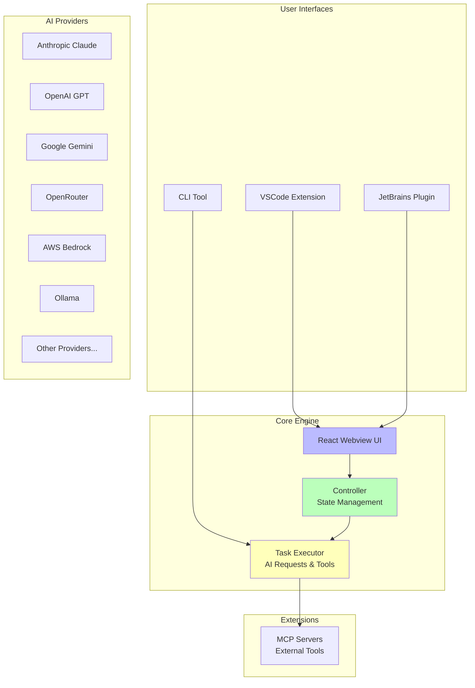

# monster

**a monster level code bot**

An advanced AI-powered coding assistant that combines deep code understanding with autonomous execution capabilities. It can create, edit, and refactor code, run commands, browse the web, and integrate with external tools through the Model Context Protocol (MCP).


## 🌟 Key Features

- **🧠 Deep Code Understanding**: Analyzes entire codebases to provide context-aware assistance
- **⚡ Autonomous Execution**: Plans, implements, and tests code changes with minimal oversight
- **🔧 Multi-Platform Support**: Available as VSCode extension, CLI tool, and JetBrains plugin
- **🤖 Multiple AI Providers**: Supports Anthropic Claude, OpenAI GPT, Google Gemini, and more
- **🔌 MCP Integration**: Extensible through Model Context Protocol servers
- **🎯 Plan/Act Mode**: Separate planning and execution phases for better control
- **🌐 Browser Automation**: Can interact with web applications and APIs
- **📝 Task History**: Persistent conversation and task tracking
- **🔒 Secure**: API keys stored securely, user approval required for actions

## 🚀 Quick Start

### VSCode Extension

1. **Install** from VSCode Marketplace
2. **Configure** your AI provider (Anthropic, OpenAI, etc.) in settings
3. **Start coding** - use `Ctrl+'` (or `Cmd+'` on Mac) to add selected code to chat

### Core Components

- **Webview UI**: React-based frontend providing the chat interface and settings
- **Controller**: Central state management and orchestration layer
- **Task Executor**: Handles AI API requests, tool execution, and streaming responses
- **MCP Hub**: Manages connections to external Model Context Protocol servers

## 🛠️ Development

### Prerequisites

- Node.js 18.0.0 or higher
- VSCode 1.84.0 or higher
- Git

### Project Structure

```
coder/
├── src/                   # Core extension code
│   ├── core/              # Main application logic
│   │   ├── controller/    # State management & webview communication
│   │   ├── task/          # AI task execution
│   │   └── webview/       # Webview provider
│   ├── api/               # AI provider integrations
│   ├── services/          # External services (MCP, etc.)
│   └── shared/            # Shared types and utilities
├── webview-ui/            # React frontend
├── cli/                   # CLI implementation
├── proto/                 # Protocol buffer definitions
├── docs/                  # Documentation site
├── testing-platform/      # Testing infrastructure
├── evals/                 # Evaluation scripts
└── scripts/               # Build and development scripts
```

## 📋 Architecture Overview

Coder follows a modular architecture designed for reliability and extensibility:



### Building

```bash
# Install dependencies
npm install

# Build the extension
npm run compile

# Build webview
npm run build:webview

# Package for distribution
npm run package
```

### Development Workflow

1. **Setup**: Clone and install dependencies
2. **Development**: Use `npm run dev` for hot reloading
3. **Testing**: Run `npm test` for unit tests, `npm run e2e` for integration tests
4. **Building**: Use `npm run compile` to build the extension
5. **Packaging**: Use `npm run package` to create VSIX for distribution

### Key Scripts

- `npm run dev` - Start development with hot reloading
- `npm run compile` - Build the extension
- `npm run test` - Run all tests
- `npm run protos` - Generate protocol buffer code
- `npm run lint` - Run linting and formatting

## 🤝 Contributing

We welcome contributions! Please see our [Contributing Guide](CONTRIBUTING.md) for details.

### Development Guidelines

- Follow the established patterns in the codebase
- Add appropriate tests for new features
- Update documentation as needed
- Use the provided linting and formatting tools
- Follow semantic commit messages

### Adding New Features

When adding new AI providers, tools, or MCP integrations:

1. Follow existing patterns in the respective directories
2. Update protocol buffer definitions if needed (`npm run protos`)
3. Add comprehensive tests
4. Update documentation
5. Create a changeset for version management

## 🔧 Configuration

Coder supports extensive configuration:

### AI Providers

Configure multiple AI providers with different models.

lmstudio example:
```json
{
  "coder": {
    "providers": [
      {
        "name": "lmstudio",
        "models": [
          "openai/gpt-oss-120b"
        ],
        "baseUrl": "http://localhost:1234"
      }
    ]
  }
}
```

ollama example:
```json
{
  "coder": {
    "providers": [
      {
        "name": "ollama",
        "models": [
          "gpt-oss:120b"
        ],
        "baseUrl": "http://localhost:11434/v1"
      }
    ]
  }
}
```

## 🧪 Testing

Coder includes comprehensive testing:

- **Unit Tests**: Core logic and utilities
- **Integration Tests**: VSCode extension functionality
- **E2E Tests**: Full user workflows with Playwright
- **Evaluation Suite**: AI model performance testing

```bash
# Run unit tests
npm run test:unit

# Run integration tests
npm run test:integration

# Run E2E tests
npm run test:e2e
```

## 📦 Distribution

This package is distributed through multiple channels:

- **VSCode Marketplace**: This page
- **OpenVSX**: For other editors

## 🛡️ Security & Privacy

- API keys are stored securely using VSCode's secrets storage
- User approval is required for all tool executions
- MCP servers run locally or in controlled environments

## 🙏 Acknowledgments

Coder builds upon the work of many open-source projects and AI research. Special thanks to:

- Cline team for their groundbreaking work on the project
- The Anthropic team for Claude
- OpenAI for GPT models
- The Model Context Protocol community
- All other contributors and users

**Coder** - Making AI-assisted coding autonomous, reliable, and accessible to everyone.

# add-on: gguf-editor


## Features

- **Metadata Inspection**: View all metadata key-value pairs stored in the GGUF file
- **Tensor Information**: Display tensor names, shapes, and quantization types
- **Search Functionality**: Search through metadata and tensor information
- **Array Truncation**: Configurable maximum number of array elements to display
- **Context Menu Integration**: Right-click on `.gguf` files in the explorer to open them
- **Webview Interface**: Clean, responsive interface for browsing file contents
- **Dark/Light Mode Toggle**: Switch between dark and light themes with a fixed toggle button
- **Theme Persistence**: Your theme preference is saved and restored on subsequent opens
- **Editable Metadata**: Direct editing of metadata fields within the interface
- **File Saving**: Save changes made to GGUF files back to disk

### Opening GGUF Files

1. **Via Context Menu**: Right-click on any `.gguf` file in the Explorer panel and select "Open gguf-editor"
2. **Via Command Palette**: Open the Command Palette (Ctrl+Shift+P) and run "gguf-editor: Open gguf-editor"

### Interface Overview

The extension opens a webview panel displaying:

- **File Header**: Shows the filename
- **Search Bar**: Filter metadata and tensors by search term
- **Metadata Table**: Key-value pairs from the file's metadata
- **Tensors Table**: Information about each tensor including name, shape, precision type, and hide/removal actions

### Search Functionality

- Enter text in the search box to filter results
- Search works across metadata keys/values and tensor names/shapes/precision
- Click "Reset" to clear the search and restore any temporarily removed tensors

## Extension Settings

This extension contributes the following settings:

- `gguf-editor.maxArrayElements`: Maximum number of elements to display in metadata arrays (default: 25)

To change these settings:

1. Click Manage then select Settings (Ctrl+,)
2. Search for "gguf-editor"
3. Modify the desired setting

## Acknowledgments

AgainstEntropy (MIT License), huggingface.js (MIT License), llama.cpp (MIT License), etc., and thanks to all contributors for their hard work.

## optional: coder CLI connector

Connect to coder CLI to work


## Features

- **Live Diff Preview**: See proposed file changes in VS Code's diff viewer before approving them in the CLI
- **Automatic Connection**: Seamlessly connects to the Coder CLI when running with `--vscode`
- **Status Bar Integration**: Quick connection status and controls from the VS Code status bar
- **Diagnostics Sharing**: VS Code's LSP diagnostics (errors, warnings) are shared with Coder for context

## Requirements
- Visual Studio Code version 1.104.0 or higher
- [Coder](https://www.npmjs.com/package/@gguf/coder) installed; if not, install it via npm:

```bash
npm install -g @gguf/coder
```

## Usage

### Starting Coder with `monster` icon

- Look for the green monster icon on the top right bar
- Click it for openning CLI and connect to Coder at the same time (status bar method, see below)


### How It Works

1. **Extension connects**: Click `Coder` from status bar then `Start CLI` to connect VS Code extension to CLI
2. Or **Start the CLI**: Run `coder --vscode` in your project directory (optional)
3. **View diffs**: When Coder proposes file changes, a diff view opens in VS Code showing:
   - Original content on the left
   - Proposed changes on the right
   - Syntax highlighting for the file type
4. **Approve/reject in CLI**: Use the Coder CLI to approve or reject changes


### Commands

Access via Command Palette (`Ctrl+Shift+P` / `Cmd+Shift+P`):

| Command                                | Description                                  |
| -------------------------------------- | -------------------------------------------- |
| `gguf-coder: Connect to Coder`     | Manually connect to the running CLI          |
| `gguf-coder: Disconnect from Coder` | Disconnect from the CLI                      |
| `gguf-coder: Start Coder CLI`       | Open a terminal and run `coder --vscode`     |
| `gguf-coder: Ask Coder about this`  | Ask Coder about selected code                |
| `gguf-coder: Explain this code`      | Get explanation of selected code             |
| `gguf-coder: Refactor this code`     | Request refactoring of selected code         |
| `gguf-coder: Open Coder Terminal`    | Open a terminal for Coder CLI                |

### Status Bar

The status bar item shows the current connection state:

- `$(plug) Coder` - Not connected (click to connect)
- `$(check) Coder` - Connected to CLI
- `$(sync~spin) Connecting...` - Connection in progress

### Configuration

Configure the extension in VS Code settings (`Ctrl+,` / `Cmd+,`):

| Setting                     | Default | Description                                      |
| --------------------------- | ------- | ------------------------------------------------ |
| `coder.serverPort`      | `51820` | WebSocket server port for communication with Coder CLI      |
| `coder.autoConnect`     | `false`  | Automatically connect to CLI on VS Code startup  |
| `coder.autoStartCli`    | `false`  | Automatically start Coder CLI if not running     |
| `coder.showDiffPreview` | `true`  | Automatically show diff preview for file changes |

## Acknowledgments

Special thanks Will Lamerton, Nano Collective (MIT License), this extension works with [nanocoder](https://github.com/nano-collective/nanocoder) as well (share the same port 51820); [continue](https://github.com/continuedev/continue) (Apache-2.0), [opencode](https://github.com/anomalyco/opencode) (MIT License), gguf-connector (MIT License), etc., and thanks to all contributors for their hard work.

## optional: bot (openclaw) connector

## Requirements
- Visual Studio Code version 1.74.0 or higher
- [OpenClaw](https://www.npmjs.com/package/openclaw) installed; if not, install it via npm:

```bash
npm install -g openclaw@latest
```

### Starting with `bot` icon
- `Bot: Show Menu` - Show the Bot menu with command options


## Acknowledgments

Special thanks Peter Steinberger and the OpenClaw Community for their invaluable contributions and support. Really appreciate.

Again, contributions are welcome! Please feel free to submit a Pull Request.

## 📄 License

MIT - see [LICENSE](LICENSE) for details.
